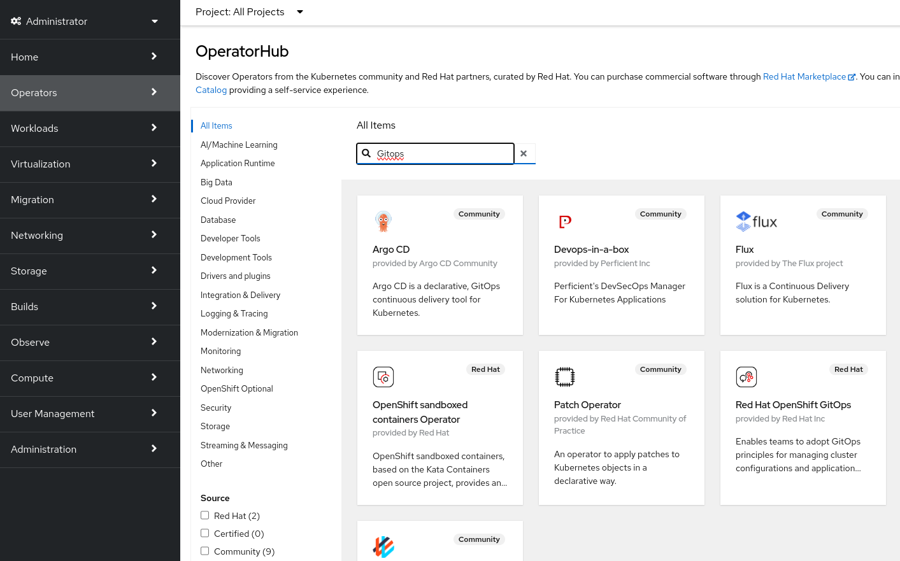
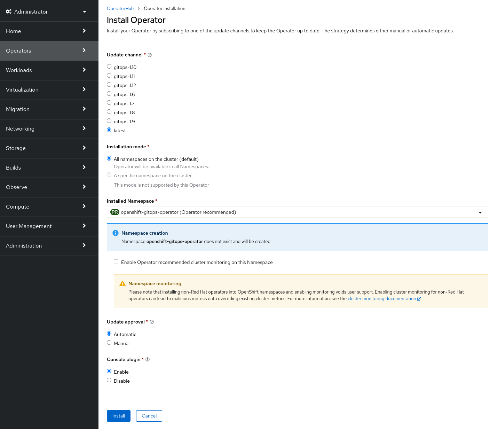
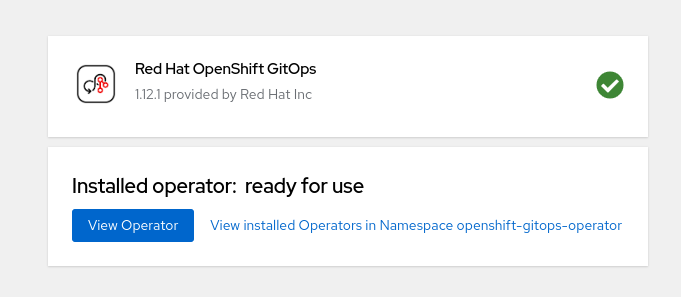
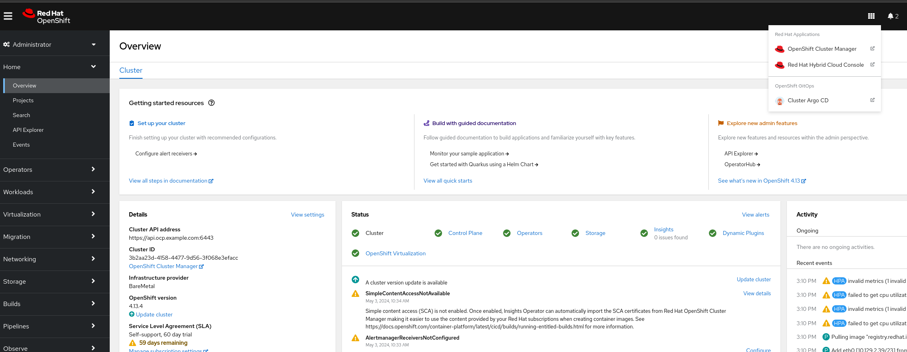
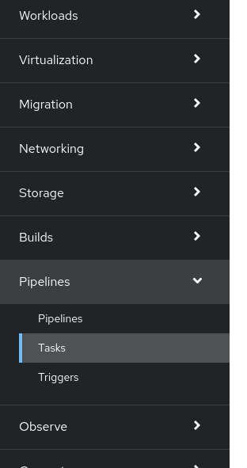

:scrollbar:
:toc2:

=  OpenShift GitOps - Setup

== Introduction

Red Hat OpenShift GitOps is a declarative way to implement continuous deployment for cloud native applications. Red Hat OpenShift GitOps ensures consistency in applications when you deploy them to different clusters in different environments, such as: development, staging, and production. Red Hat OpenShift GitOps helps you automate the following tasks:

- Ensure that the clusters have identical state for configuration, monitoring, and storage
- Recover or recreate clusters from a known state
- Apply or revert configuration changes to multiple OpenShift Container Platform clusters
- Associate templated configuration with different environments
- Promote applications across clusters, from staging to production

To learn more about OpenShift GitOps go to the link:https://docs.openshift.com/gitops/1.12/release_notes/gitops-release-notes.html[official documentation].

In this exercise we will learn how to:
- Install GitOps to the OCP cluster and access it
- Use GitOps to
  - install Operator to cluster
  - configure virtualization installation

== Install OpenShift GitOps

Firtsly we will install the GitOps operator. Go to the OpenShift console, Operators and search for GitOps:

Choose the *Red Hat OpenShift GitOps* operator. Explore default values and click install.

Click *View Operator* after it is successfully created.

[NOTE]
As part of setup necessary privileges must be provided to the GitOps instance. Depending on the scope of the GitOps. To simplify this step cluster-admin privileges were granted to GitOps instance using command `oc adm policy add-cluster-role-to-user cluster-admin system:serviceaccount:openshift-gitops:openshift-gitops-argocd-application-controller`

== Add OpenShift Pipelines to the cluster

We were installing GitOps operator manually in previous step. Now we will do the same for OpenShift Pipelines operator, but using OpenShift GitOps.

This will come handy if you want consistent configuration across your clusters.

Go to ArgoCD instance and log in using OpenShift username and password:

Create an application to install OCP Pipelines using following parameters:

[source,yaml]
----
name: pipelines-config
destination:
  name: ""
  namespace: openshift-cnv
  server: "https://kubernetes.default.svc"
source:
  path: gitops/pipelines
  repoURL: "https://github.com/jwerak/roadshow_ocpvirt_cicd.git"
  targetRevision: HEAD
project: default
syncPolicy:
  syncOptions:
    - ServerSideApply=true
----

image::images/GitOps/07_application_pipelines.png[]

Click *Sync* button to apply manifests.

Wait until pipelines section is ready in console before proceeding.

Meanwhile you may explore the link:https://github.com/jwerak/roadshow_ocpvirt_cicd/tree/main/gitops[git repository] that is used as a source to this ArgoCD Application.

== Add KubeVirt tekton tasks to OCP Pipelines

We will need custom tekton ClusterTasks for our next exercise. These tasks are part of a OpenShift Virtualization and can be added if feature gate _deployTektonTaskResources_ is enabled.

NOTE: KubeVirt adds _ClusterTask_, but in OpenShift 4.14+ it will be _Task_ resources.

NOTE: It is more common in GitOps approach to manage resources from day one.

Now lets create the GitOps Application to configure HyperConverged object:

[source,yaml]
----
name: hyperconverged-config
destination:
  name: ""
  namespace: openshift-cnv
  server: "https://kubernetes.default.svc"
source:
  path: gitops/virtualization
  repoURL: "https://github.com/jwerak/roadshow_ocpvirt_cicd.git"
  targetRevision: HEAD
project: default
syncPolicy:
  syncOptions:
    - ServerSideApply=true
----

Your cluster is now ready for link:./14_create_vm_pipelines.adoc[next exercise] where you will learn how to automate VM tasks using OpenShift Pipelines.