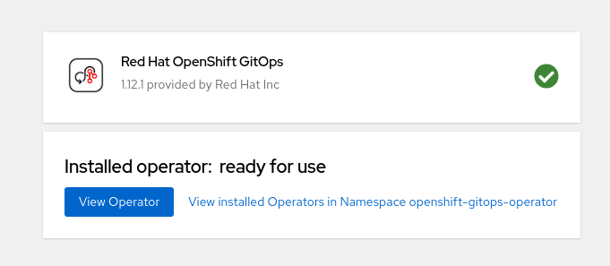

:scrollbar:
:toc2:

=  OpenShift GitOps - Setup

== Introduction

== Install OpenShift GitOps

Install OpenShift GitOps

image::images/GitOps/01_GitOps_Operator_Find.png[]

Use defaults and press Install.

image::images/GitOps/02_GitOps_operator_install.png[]

Click View Operator

Create ArgoCD instance

== Add OCP Pipelines to cluster

Go to ArgoCD instance and log in using OpenShift.

image::images/GitOps/06_access_agrocd.png[]

Create an application to install OCP Pipelines using following parameters:

[source,yaml]
----
name: pipelines-config
destination:
  name: ""
  namespace: openshift-cnv
  server: "https://kubernetes.default.svc"
source:
  path: gitops/pipelines
  repoURL: "https://github.com/jwerak/roadshow_ocpvirt_cicd.git"
  targetRevision: HEAD
project: default
syncPolicy:
  syncOptions:
    - ServerSideApply=true
----

image::images/GitOps/07_application_pipelines.png[]

Click *Sync* button to apply manifests.

Wait until pipelines section is ready in console.

image::images/GitOps/08_pipelines_tab.png[]

Meanwhile you may explore the link:https://github.com/jwerak/roadshow_ocpvirt_cicd/tree/main/gitops[git repository] that is used as a source to this ArgoCD Application.

== Add KubeVirt tasks to OCP Pipelines

To add tasks we need to switch HyperConverged featureGate *deployTektonTaskResources* to `true`.
In proper GitOps scenario this feature gate would be enabled during initial installation of.

Create another GitOps Application:

[source,yaml]
----
name: hyperconverged-config
destination:
  name: ""
  namespace: openshift-cnv
  server: "https://kubernetes.default.svc"
source:
  path: gitops/virtualization
  repoURL: "https://github.com/jwerak/roadshow_ocpvirt_cicd.git"
  targetRevision: HEAD
project: default
syncPolicy:
  syncOptions:
    - ServerSideApply=true
----
