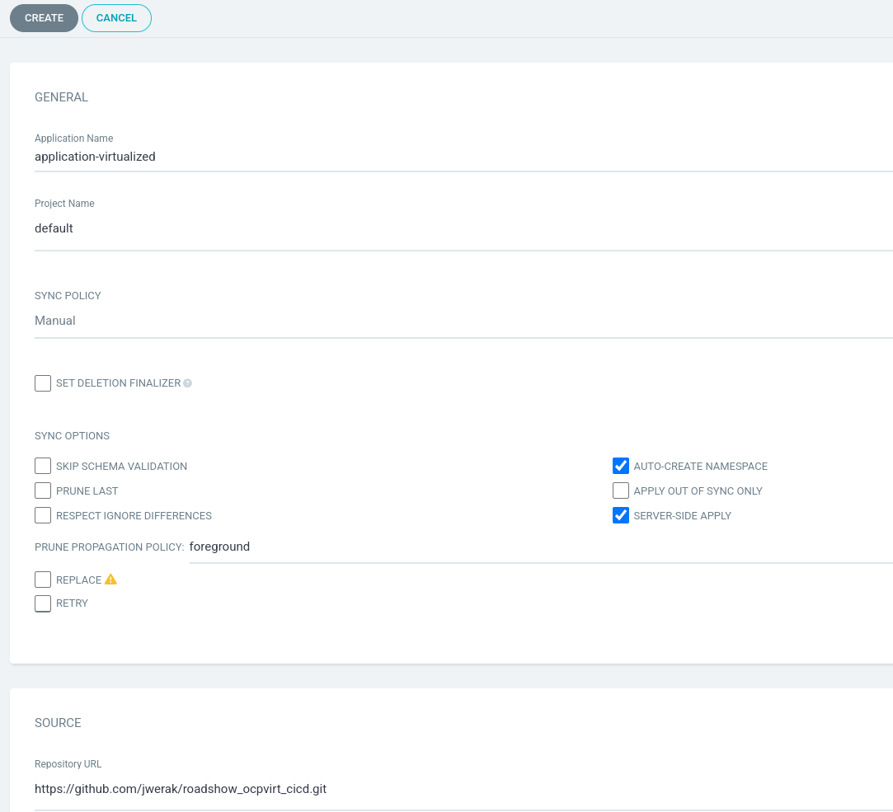
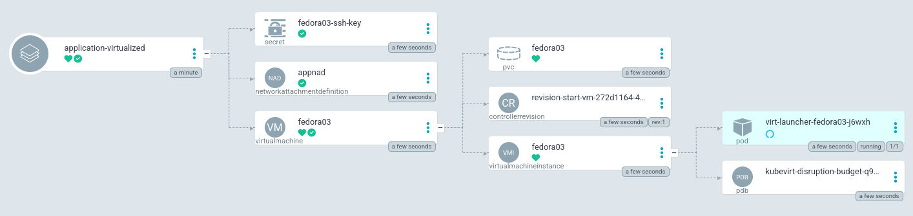
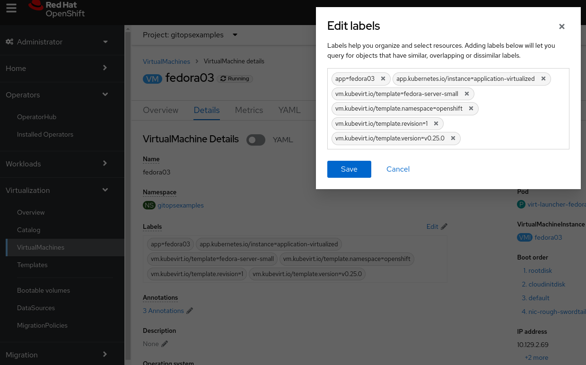
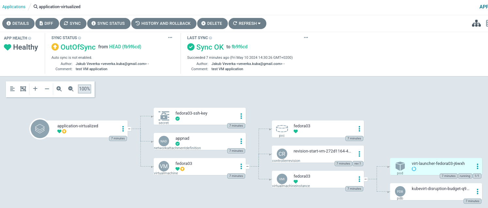

:scrollbar:
:toc2:

=  OpenShift GitOps - Setup

== Introduction

It is quite simple to create and configure VM using OpenShift Console, but it can be lengty and error prone if this needs to be done manually at scale.

In this exercise we will create and configure VM in fresh environment using GitOps approach.

The VM will be
- based on Fedora OS
- using additional bridge interface
- accessible with predefined ssh key

== VM Creation

Go to OpenShift Cluster ArgoCD instance and crate new application with following parameters:

[source,yaml]
----
destination:
  name: ""
  namespace: gitopsexamples
  server: "https://kubernetes.default.svc"
source:
  path: gitops/virtualized-application
  repoURL: "https://github.com/jwerak/roadshow_ocpvirt_cicd.git"
  targetRevision: HEAD
sources: []
project: default
syncPolicy:
  automated: null
  syncOptions:
    - ServerSideApply=true
    - CreateNamespace=true
----

Manually Synchronize the application.

You can observe how VM and other components are created.

Also feel free to explore the application manifests are located in this link:https://github.com/jwerak/roadshow_ocpvirt_cicd/tree/main/gitops/virtualized-application[GitHub repository].

Shortly your environment should contain:

- New Project `gitopsexamples`
- NetworkAttachDefinition `appnad`
- Secret `fedora03-ssh-key` containing ssh public key
- Running VM using above resources.

== VM Customization

The benefit of using of ArgoCD is not only in quick creation of complex multi-component applications.
ArgoCD is also continually monitoring the state of deployed application and potentially revert unwanted changes.

Lets try this by changing label of our virtualized application.

Go to OpenShift Console and remove any label.

Now go to the ArgoCD console and observe the change in VM application:

Lets revert the misconfiguration by synchronizing application manually.

NOTE: The ArgoCD can be configured to sychronize application automatically, but we are using manual only approach for simplicity and clarity.

== VM Cleanup

ArgoCD understands the objects which were created by it and its dependencies.
This is why the application can be fully cleaned once it is not needed.

Lets again go to the ArgoCD console, click on the application `application-virtualized` and delete it.
You will have to type the application name to confirm its deletion.

You may go to OpenShift console to validate that VM, secret and NetworkAttachDefinition are missing.

== Stretch activities

Explore other possibilities:

- Explore link:https://docs.openshift.com/gitops/1.12/understanding_openshift_gitops/what-is-gitops.html[OpenShift GitOps documentation]
- Fork GitHub repository and customize VM further
- Explore link:https://argo-cd.readthedocs.io/en/stable/user-guide/resource_hooks/[Resource Hooks] which could be used to:
  - calling post-creation automation, e.g. creating AnsibleJob CR
  - send message/email when VM is created or deleted
